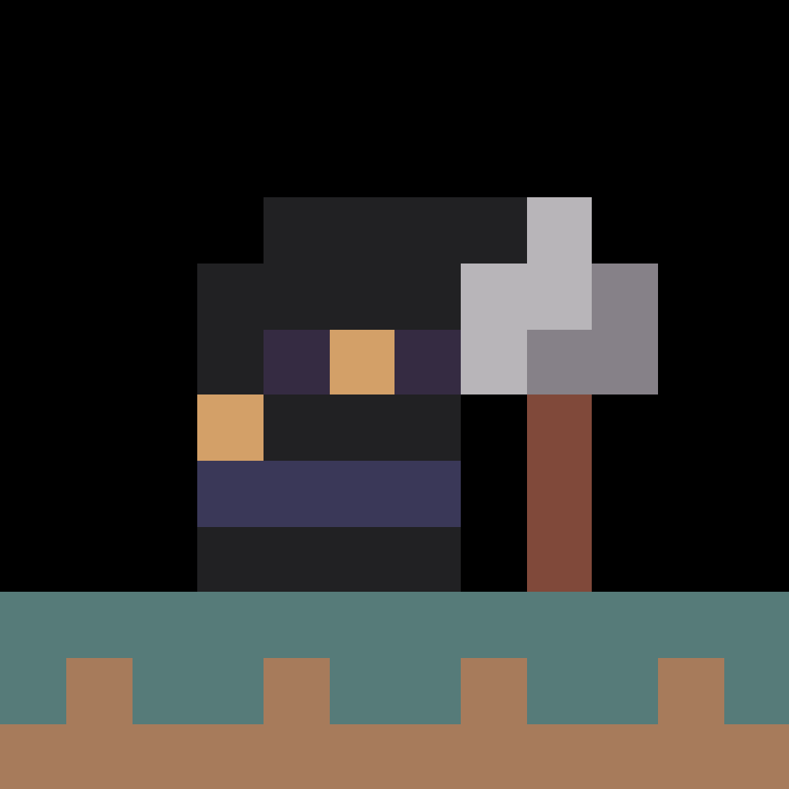
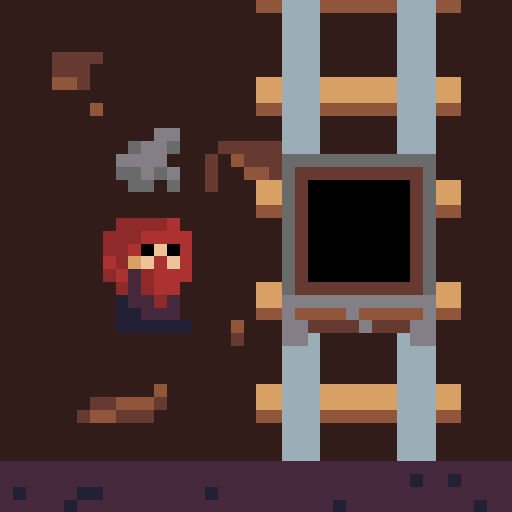
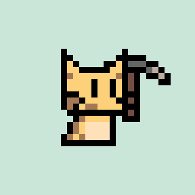

## Hi there 👋

Hi 👋

I am Erick Zanardo, I am Brazilian and I have been working with software development since 2008. I have worked with many different platforms and stacks along my carrier, like Java, NodeJs, Ruby, Vanilla JS, React and many others.

Since 2016 I have been focusing on mobile development, where I started with React Native and then moved to Flutter, where I stayed and where I am focusing my carrier as well as my OSS efforts.

I help maintain a couple of Flutter packages and projects, but the ones that I am most know from are [Flame](https://flame-engine.org/), a Flutter based game engine and [Nes UI](https://github.com/erickzanardo/nes_ui), a Flutter design system inspired by retro game consoles!

# Games

<table>
    <tr>
        <td>
             
            <a target="_blank" href="https://cherrybit.studio/gravedigger-doug/">Gravedigger Doug</a>
        </td>
        <td>
             
            <a target="_blank" href="https://cherrybit.studio/mine-cart-operator/">Mine Cart Operator</a>
        </td>
        <td>
             
            <a target="_blank" href="https://cherrybit.studio/mine-cat-digger/">Mine Cat Digger</a>
        </td>
    </tr>
</table>

I create games under [Cherry Bit Studios](https://cherrybit.studio/), some are free, and some are paid, but no game will ever rely in predatory monetisation methods!

Check all of them on my [web site](https://cherrybit.studio/games/)!

# Featured Sponsors

Check out these amazing sponsors that support my work!

<table style="background-color: white; border: 1px solid black">
    <tbody>
        <tr>
            <td align="center" style="border: 1px solid black">
                <a href="https://invertase.io/">   Invertase </a>
            </td>
        </tr>
    </tbody>
</table>

[Become a featured sponsor!](https://cherrybit.studio/featured-sponsors/)
